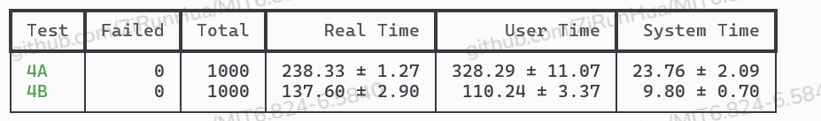
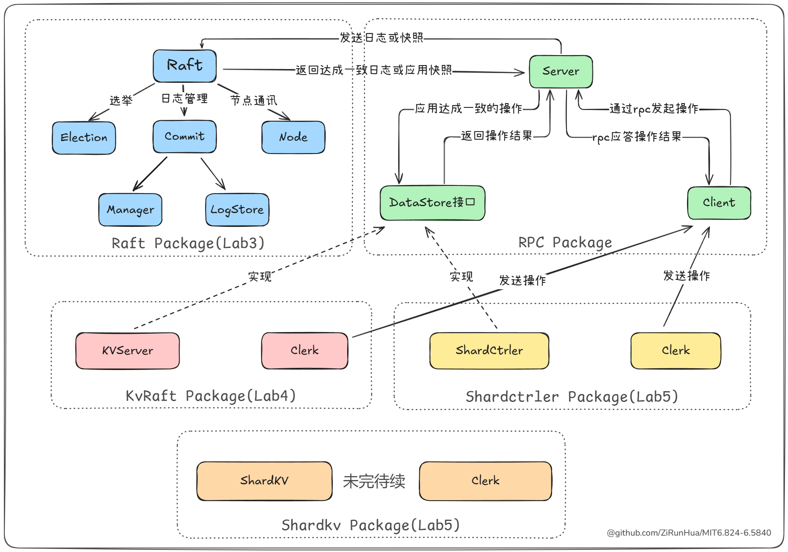

## 介绍
**MIT6.5840分布式系统课程深度解析：后端工程师的进阶指南**

作为MIT计算机科学领域的明珠课程，6.5840（原6.824）通过"实现-理解"的硬核模式，为后端开发者打开分布式系统的底层黑盒。当你在工作中熟练使用 Redis Cluster 的故障转移、MySQL 
主从同步的读写分离时，是否思考过这些技术背后的共识算法实现？当你在 K8s 中部署微服务时，是否想探究 etcd 如何通过 Raft 协议保障配置一致性？这正是本实验课程要带给你的思维升维。

**上面介绍由 DeepSeek 生成的，后面的所有内容则由本人真诚分享😊**

在了解了 Redis 集群哨兵和 MySQL 主从后，对背后的分布式有点感兴趣，看完《数据密集型应用系统设计》后，我已迫不及待，后来了解到 MIT 6.5840 课程，正好是使用 Go 语言，并且实验中频繁涉及协程和通道，这正好又是 Go 语言绝佳地进阶训练场，于是便开始了实验。

## 通关标准
### Lab3
如果没有达到下面的要求，我认为完全不能认为完成实验

- 所有测试 1000 次运行稳定通过
- 6 分钟的实际运行时间和 1 分钟的 CPU 时间（来自 lab3 的最后一个 `Hint`）

  

### Lab4
- 所有测试 1000 次运行稳定通过
- 400 秒的实际运行时间和 600 秒的 CPU 时间（来自 lab4 的最后一个 `Hint`），以及 TestSnapshotSize 测试小于 20 秒

> 1000 次运行太久了，大概要 12 小时，我会很快换上 1000 次运行的截图

  

 
最终，计算资源充足情况下的运行情况为:
|  | Real Time | User Time |
| --- | --- | --- |
| Lab3 | 323.06 | 25.13 |
| Lab4 | 375.55 | 464.51 |

实验的难点并不在于实现，也不在达到测试要求的运行时间，而在于确保所构建系统的稳定性和可靠性。我比较多的时间都花在解决 1000 次测试中出现的那一两个失败上，而这一两个失败可能需要花费好几个小时才能找到答案。
> 运行时间只能做个参考，因为语言版本和运行环境不一致，实验使用 GO 1.15 而我使用的是 GO 1.19，但实验实现的是一个 I/O 密集型系统，语言对实际运行时间较小，但对 CPU 时间影响较大（取决于 Go 的性能提升）。
## 开源目的
记录在实验过程中遇到的问题与解决方案，分享优化策略，并从系统设计角度分析与实现各个模块，同时展示 Golang 中面向接口的编程思想。

我会以图文的形式，讲述我的实现，总共 15 张图，下面是其中一张：

  
  
<em>实现概述</em>

下面是每个 Lab 的详细设计：
- [Lab3: Raft](./docs/lab3/README.md)
- [Lab4: KvRaft](./docs/lab4/README.md)
- Lab5 未完待续
> 原来是 4 个实验，现在是 5 个，lab2 是新加入的，lab3 到 lab5 是实验的核心内容。lab1 和 lab2 相对简单，这里不再赘述，但它们同样值得完成，因为有助于你对实验的初步了解，并能够增强自信心，从而顺利完成后续实验。
>
> 实验使用了 Go 1.15，考虑到 Go 的向后兼容性，建议使用 Go 1.19 及以上版本，因为该版本除了支持泛型外，`sync/atomic` 包也得到了增强，新增了原子类型，可以方便应对并发场景。

## 也许你会用到
- 课程网站：https://pdos.csail.mit.edu/6.824/
- 助教文章
  - https://thesquareplanet.com/blog/students-guide-to-raft/
  - https://thesquareplanet.com/blog/instructors-guide-to-raft/
- 脚本
  - [助教脚本](https://gist.github.com/JJGO/0d73540ef7cc2f066cb535156b7cbdab)
  - [我的脚本](https://gist.github.com/ZiRunHua/b534df847d13d9962ce6d3e18afa7561) 我 fork 了助教脚本，增强了 `-t` 让它也可以在 `linux` 环境上使用（原先只能在`Mac`）

以及在实验过程中，我编写并使用的一些[小工具](./util)，希望能够帮助你节省与实验无关的时间
## 声明
B 站的课程视频中有提到不允许公开实验代码，所以我只会分享我的实验思路和解决方案，但还是看到有人发出源码