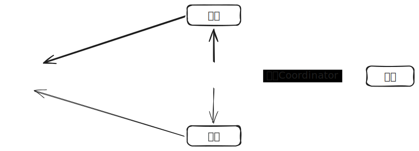
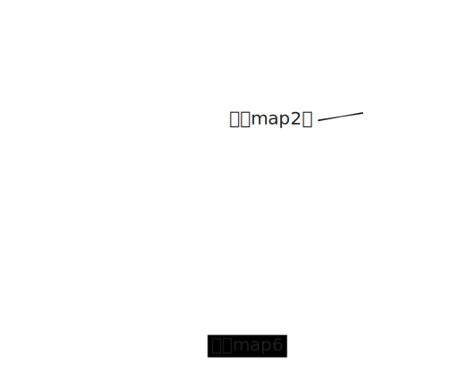

## Worker
Worker的实现没有什么特别，通过轮训来执行任务，os.Rename来保证文件完成的原子性
## Coordinator

### 任务状态
无论是`Map`任务还是`Reduce`任务都要经过一下状态



### 存在的数据竞争点
`Worker`并发向`Coordinator`获取任务，同时因为一些任务超时而被重新分配，导致一个任务可能会同时收到多份报告，这些是需要解决的数据竞争的点，显然用`chan`解决这些问题再合适不过了



### 分配器
依上我们可以设计一个`Map`和`Reduce`都可以使用的任务分配器`Manager`,它像是一个经理，它有两个助理，一个负责分配工作（分配任务），一个复制考核绩效（接收报告）
```go
type (
    Manager struct {
        works           []*Work
        assignAssistant chan int
        reportAssistant chan WorkReport
        // reportToBoss 完成后的回调
        reportToBoss func()
        // isFinish 完成工作会以关闭通道的方式通知助理，isFinish用来防止向关闭的通道写入数据
        isFinish bool
    }
    Work struct {
        // id 通过id标识任务，在向worker返回任务前需要通过id去获得任务的额外数据
        id       int
        workTime time.Time
        status   workStatus
    }
    WorkReport struct {
        Id       int
        IsFinish bool
    }
    workStatus int
)

const (
    Waiting = iota
    Assigning
    Working
    Finish
)
```
助理的工作分别是

`assignWork`负责分配工作、检查工作是否全部完成，发现超时的工作并向`reportAssistant`报告

```go
func (m *Manager) expression() {
    go m.assignWork()
    go m.reportWork()
}

func (m *Manager) assignWork() {
    for true {
        finish := true
        checkCount := 0
        for _, work := range m.works {
            finish = finish && (work.status == Finish)
            switch work.status {
            case Finish:
                continue
            case Assigning:
                continue
            case Working:
                if !work.timeout() {
                    continue
                }
                checkCount++
                m.processReport(WorkReport{Id: work.id, IsFinish: false})
            default:
                checkCount++
                // 需要修改状态为Assigning，以免重新被分配
                work.status = Assigning
                m.assignAssistant <- work.id
            }
        }
        if checkCount == 0 {
            time.Sleep(time.Second)
        }
        if !finish {
            continue
        }
        m.endWork()
        m.reportToBoss()
    }
}
```
`reportAssistant`负责接收报告并修改`Work`状态
```go
func (m *Manager) reportWork() {
    for true {
        report, open := <-m.reportAssistant
        if !open {
            return
        }
        work := m.works[report.Id]
        if work.status != Working {
            continue
        }
        if report.IsFinish {
            work.status = Finish
        } else {
            work.status = Waiting
            work.workTime = time.Time{}
        }
    }
}
```
为了避免任务被重复写入`chan`，需要增加一个状态`Assigning`，最后各方对`Work`状态控制如下：


- assignAssistant：将`Waiting`任务修改为`Assigning`，同时检查超时任务，向`reportAssistant`发送超时任务的失败报告
- reportAssistant：将`Working`任务修改为`Waiting`,或将`Working`任务修改为`Finish`
- worker：`worker`通过rpc获取`assignAssistant`中的`Assigning`任务，并将状态修改为`Working`

所以`assignAssistant`、`reportAssistant`、`worker`三方都不会操作相同的任务,从而避免数据竞争

分配器整体流程如下


### Coordinator整体
```go
type (
    Coordinator struct {
        targets       []string
        mapManager    *Manager
        reduceManager *Manager

        phase projectPhase
    }

    projectPhase int
)

const (
    InMapping     projectPhase = iota
    InReduce      projectPhase = iota
    PerfectFinish projectPhase = iota
)
```
Coordinator像是一个boss，它需要完成一个项目，这个项目有两个阶段`Map`和`Reduce`，它将每个阶段分配给一个经理（Manager），经理在完成工作后会通知助理停止工作（关闭`chan`），会报告boss（通过`Manager.reportToBoss`回调），以推送项目进入下个阶段，最后boss只需要不停得在`Done`的check项目阶段即可


