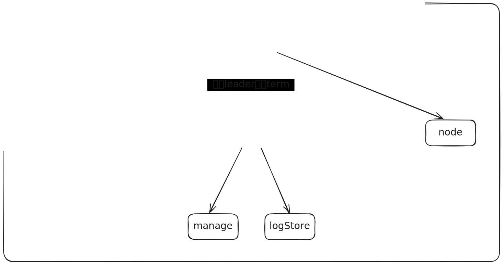

## lab3

### 难点

- 从论文中准确地提炼出具体需求，不遗漏任何细节，实验的大部分时间花在寻找遗漏的细节。
- 并发调试。

### 通关标准
- 6分钟的实际运行时间和1分钟的CPU时间（来自lab3的最后一个`Hint`）。

- 所有测试1000次运行稳定通过

### 系统概述

好的系统设计可以降低复杂度，在合适的地方设置锁，从而减低锁的颗粒度，提高性能。

#### 模块划分



Raft分为三个模块Elect、Commit、Node

- Elect负责选举，raft在发起选举时会传递选举的term给Elect，Elect在选举完成后向Raft反馈选举结果和对应的term，所以elect会有一个独立的锁。
- Commit负责管理日志，他有两个子模块负责管理日志的Commit.Manage，负责日志的存储和访问的Commit.LogStore。
- Node负责和其他节点的通讯、保持Leader地位（发送心跳），以及存储节点的临时状态（不持久化），例如节点的同步进度。

模块间的调用关系如下：


raft在需要发起选举时，将新的选举号传递给Elect，Elect向Node发送预选举，预选举通过后向node发送拉票请求，Elect选举结束后向raft报告选举结果和term，raft根据当前状态，来决定是否转变身份。

raft将接收的日志和快照交由Commit处理，Commit将数据交由LogStore保存，并在处于Leader状态时启用Manager，由Manager负责向Follower同步状态、维持Follower的同步进度，以及提交应用被大多数Follower所同步的日志。

#### 锁顺序

为各个模块设置锁，从而减低锁的颗粒度，提高性能，同时为了避免死锁，对于Elect和Commit向Raft的回调，需接触当前锁后再回调、或在新的协程中回调，最后依照模块调用关系形成如下锁顺序：


### 模块设计

#### Raft

#### Elect

##### 骨架

```go
type (
	Election interface {
	PreVote() bool
	Do()
	End()
}
Candidate interface {
	WinElection(term int)
	FailElection(term int)
}
Voter interface {
	PreVote(term int, lastCommand commit.LogEntry) bool
	AskVote(term int, ballotBox BallotBox, lastCommand commit.LogEntry)
}
election struct {
	term int
	
	candidate Candidate
	voters    []Voter // 选民不包括自己  
	ballotBox BallotBox
	
	lastCommand commit.LogEntry
	close       atomic.Bool
}
BallotBox chan bool
)
```

- 在 Election 看来，整个 Raft 实例是一个 `Candidate`，负责竞选并处理选举结果。
- 集群中的每个`Node`被视为 `Voter`，负责参与预选和正式投票。

这便是golang新编程理念的体现：通过接口和抽象分离逻辑

每次选举会new一个新的Election，在选举前会先通过PreVote，测试中频繁让节点失联，所以引入预选举机制保证Leader免受重连节点的影响是非常有必要的，对于性能的提高非常有帮助。
> 预选举介绍
>
> 在Raft算法中，Follower节点如果在一定时间内未接收到Leader的心跳，会认为当前Leader已失效，并通过自增`term`
> 发起选举。但如果该Follower因网络隔离等原因无法与集群中的其他节点通信，其选举必然失败。此时，该Follower会不断重复这一过程，导致其`term`
> 值持续增长。
>
> 当隔离的Follower重新与集群中的其他节点建立通信时，由于其`term`
> 值比当前Leader和其他节点都大，根据Raft规则，Leader会发现自身的`term`较小并转为Follower状态。然而，由于没有新的Leader产生，集群必须重新发起选举，才能恢复正常工作。
>
>
预选举通过在正式发起选举前，候选节点向集群中的其他节点发送预选投票请求，询问自己是否具备选举资格。如果大多数节点同意，其才会自增`term`
并发起正式选举。这样可以有效避免脱离集群的节点因无意义的`term`增长而干扰集群的正常运行。

#### Commit

#### Node

TestCount3B会测试rpc的调用次数 rpc调用次数不能过多

TestCount3B之前一直正常通过所以没留下什么印象，但是在完成lab3C时，对rpc部分进行了重构，依照模块将rpc分成四种，选举模块的拉票、日志模块的日志同步和提交进度同步(
告诉跟随节点哪些消息可以被提交应用)，以及Leader的心跳，在回头重测lab3B时TestCount不通过

仔细查看TestCount3B是用来测试rpc调用次数是否过多，确实通讯次数也是一个衡量共识算法性能的指标

其中心跳在最近已经发送过日志同步时可以忽略，所以可以在心跳rpc中加入判断

提交进度同步允许丢失，因为只要日志在集群中达成共识那么提交进度就不会丢失，因此可以将需要发送的提交进度暂存，在下次rpc时再携带，同时用chan营造出等待rpc响应的样子。

lab3C中提到了关于日志同步冲突时的小优化算法，

lab3C持久化比较简单，但是lab3B中未发现的错误会在lab3C中体现，可以理解为把lab3B的部分测试弄到了lab3C，以平衡难度，总之通过lab3C还是很难。
在lab2B时保存日志

在lab3C的TestFigure8Unreliable3C中引入了一个新的概念，预投票（Pre-Vote）机制
预投票（Pre-Vote）机制
预投票机制可以显著优化选举流程并减少错误的选举尝试：

预投票的工作原理：

在节点正式进入候选状态之前，发送一个 PreVote 请求，询问集群是否可以支持其成为领导者。
如果集群中的多数节点认为当前节点的日志不够新（lastLogTerm 或 lastLogIndex 不匹配），预投票阶段就会失败，节点不会进入正式的选举阶段。
优势：

防止因过时节点触发选举，导致集群进入不稳定状态。
避免在分区恢复时，立即触发不必要的选举。

如果刚刚向节点发送过同步消息，则不需要不需要再发送心跳，
这一优化在测试TestFigure8Unreliable3C时可以将协程数量减少到原来的十分之一