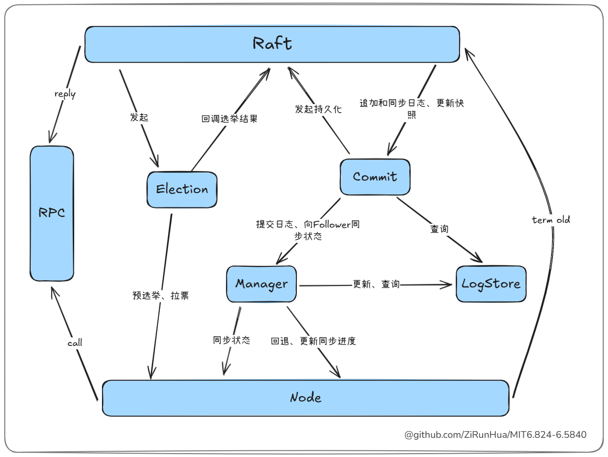
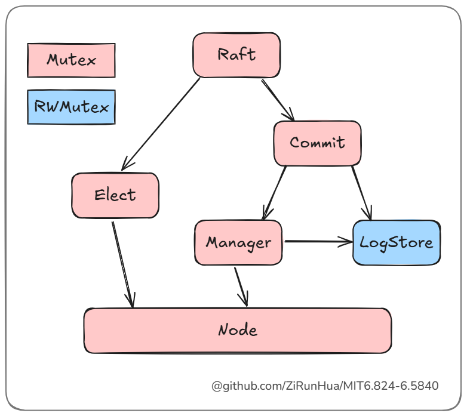

## lab3

### 难点

- 从论文中准确地提炼出具体需求，不遗漏任何细节，实验的大部分时间花在寻找遗漏的细节。
- 并发调试。

### 通关标准

- 6分钟的实际运行时间和1分钟的CPU时间（来自lab3的最后一个`Hint`）。
- 所有测试1000次运行稳定通过

### 系统概述

好的系统设计可以降低复杂度，在合适的地方设置锁，从而减低锁的颗粒度，提高性能。

#### 模块划分

<div style="text-align:center">
  
</div>

Raft分为三个模块Elect、Commit、Node

- Elect负责选举，raft在发起选举时会传递选举的term给Elect，Elect在选举完成后向Raft反馈选举结果和对应的term，所以elect会有一个独立的锁。
- Commit负责管理日志，他有两个子模块，Manage 负责管理日志，LogStore 负责日志的存储和读取。
- Node负责和其他节点的通讯、保持Leader地位（发送心跳），以及存储节点的临时状态（不持久化），例如节点的同步进度。

模块间的调用关系如下：
<div style="text-align:center">
  
</div>
raft在需要发起选举时，将新的选举号传递给Election，Election向Node发送预选举，预选举通过后向node发送拉票请求，Elect选举结束后向raft报告选举结果和term，raft根据当前状态，来决定是否转变身份。

raft将接收的日志和快照交由Commit处理，Commit将数据交由LogStore保存，并在处于Leader状态时启用Manager，由Manager负责向Follower同步状态、维持Follower的同步进度，以及提交应用被大多数Follower所同步的日志。

#### 锁顺序

为各个模块设置锁，从而减低锁的颗粒度，提高性能，同时为了避免死锁，对于 Election 和 Commit 向 Raft 的回调，需解除当前锁后再回调、或在新的协程中回调，最后依照模块调用关系形成如下锁顺序：
<div style="text-align:center">
  
</div>

### 模块设计

#### Raft

#### Election

##### 骨架

```go
type (  
    Election interface {  
       PreVote() bool  
       Do()  
       End()  
    }  
    Candidate interface {  
       WinElection(term int)  
       FailElection(term int)  
       GetMe() int  
    }  
    Voter interface {  
       PreVote(term int, latest commit.LogEntryID, applyIndex int) bool  
       AskVote(term int, ballotBox BallotBox, latest commit.LogEntryID, applyIndex int)  
    }  
    election struct {  
       term             int  
       latest           commit.LogEntryID  
       latestApplyIndex int  
       candidate        Candidate  
       voters           []Voter // 选民不包括自己  
       ballotBox        BallotBox  
  
       close atomic.Bool  
    }  
    BallotBox chan bool  
)
```

- 在 `Election` 看来，整个 Raft 实例是一个 `Candidate`，负责竞选并处理选举结果。
- 集群中的每个`Node`被视为 `Voter`，负责参与预选和正式投票。
##### 成为Leader的条件
- 最后一条日志最新。
- 论文 `Figure 8` 中提到的 Leader 需要拥有所有已提交日志条目。
**针对 Leader 需要拥有所有已提交日志**：
前提我们的提交机制可以保证，一旦某个节点的某个索引位置的日志被提交，那么其他节点在未来提交相同索引位置的日志时，内容必定一致。
>在 commit 模块通过两阶段提交保证。
在这个前提保证下，我们的选举只需要以下逻辑就可以选举出正确的 Leader
- 日志最新
- 提交的日志更长，也可以说最新提交的日志索引更大
##### 预选举
每次选举会new一个新的 Election，在选举前会先通过PreVote，测试中频繁让节点失联，所以引入预选举机制保证Leader免受重连节点的影响是非常有必要的，对于性能的提高非常有帮助。
>预选举介绍
>在Raft算法中，Follower节点如果在一定时间内未接收到Leader的心跳，会认为当前Leader已失效，并通过自增`term`
>发起选举。但如果该Follower因网络隔离等原因无法与集群中的其他节点通信，其选举必然失败。此时，该Follower会不断重复这一过程，导致其`term`
>值持续增长。
>当隔离的Follower重新与集群中的其他节点建立通信时，由于其`term`值比当前Leader和其他节点都大，根据Raft规则，Leader会发现自身的`term`较小并转为Follower状态。然而，由于没有新的Leader产生，集群必须重新发起选举，才能恢复正常工作。
>预选举通过在正式发起选举前，候选节点向集群中的其他节点发送预选投票请求，询问自己是否具备选举资格。如果大多数节点同意，其才会自增`term`
>并发起正式选举。这样可以有效避免脱离集群的节点因无意义的`term`增长而干扰集群的正常运行。
#### Commit
这是最重要的模块，主要负责日志的管理，Node 在这里充当 Follower，提供了状态同步、应用同步和同步进度更新等接口。
##### 骨架
```go
Raft interface {  
    GetMe() int  
    ApplyCommand(logEntries []LogEntry)  
    ApplySnapshot(index int, snapshot []byte)  
    UpdateApplyIndex(index int)  
}
Manager interface {  
    Append(LogEntry interface{}) *LogEntry  
    // GetLatestApplyIndex 获取最新提交应用的日志ID  
    GetLatestApplyIndex() int  
    // GetLatestLogEntry 获取最新日志  
    GetLatestLogEntry() *LogEntry  
    // SyncStatus 同步来自Leader的日志  
    SyncStatus(prev *LogEntryID, LogEntry []*LogEntry, snapshot *Snapshot) (XTerm int, XIndex int, XLen int)  
    // SyncApply 同步来自Leader提交应用进度  
    SyncApply(index int)  
    // LogIsLatest 检查日志索引是不是最新  
    LogIsLatest(unique LogEntryID) bool  
    GetLogEntry(index int) *LogEntry  
    GetMultiLogEntry(start, end int) (logEntries []LogEntry)  
    UpdateSnapshot(entry LogEntry, snapshot []byte) bool  
    GetPersistentData() (logEntries []*LogEntry, snapshot []byte)  
    Load(entries []*LogEntry, snapshot []byte)  
    Start(term int, followers []Follower)  
    Stop()  
}
Follower interface {  
    GetNodeId() int  
    SyncState(term int, prev *LogEntry, logEntries []*LogEntry, snapshot *Snapshot) (cmn.SendStatus, cmn.Conflict)  
    GetPrepareIndex() int  
    PrepareCommit(term, index int) bool  
    ConfirmCommit(term int, index int) bool  
    GetLogIndex() (index int, verify bool)  
    AddLogIndex(add int) int  
    RollbackLogIndex(index int)  
}
```
##### 日志的提交应用
为了顺利通过测试了解测试是非常有必要的，提交应用的测试代码主要在 `/src/raft/config.go` 下两个方法 `applier` 和 `checkLogs` ，它们的要求主要是：
- 按 `index` 顺序提交，不可以跳过某个 `index`。
- 每个节点提交 `index` 对应的内容必须相同，需要应对论文 `Figure 8` 描述的情况，实验中有针对该情况的两个测试 `TestFigure83C` 和 `TestFigure8Unreliable3C`。
完成以上要求需要使用两阶段提交：
<div style="text-align:center">
  
</div>
为了减少尽量缩短一条日志从同步到提交应用所花费的时间，Leader 最好在每次向某个 Follower 同步成功后，都检查一次是否有新的日志被集群中的大多数节点同步成功，但在实现上如果多个 Follower 同时同步成功，显然我们只需要检查一次就够了，所以你或需要一个节流器[throttle](https://github.com/ZiRunHua/MIT6.824-6.5840/src/util/chanUtil/throttle.go)。
**预提交**
预提交的目的是，将新的提交进度向已同步至该进度的 Follower 同步，最终使得该同步进度在大多数节点上一致。
Leader 在检查到一条新的日志被大多数节点同步后，更新自己的提交进度并且持久化，同时向已同步该日志的 Follower 发起预提交，Follower 在接收到预提交后只会更新提交进度并且持久化，因为是在同步成功后发起预提交，所以持久化的数据中包含了同步成功的日志，即需要被提交的日志条目。
如果 Leader 在预提交的过程中发生中断（Leader变更、被Kill等）：
- 如果提交进度被大多数节点接收并持久化，那么预提交还是成功。
	那么该提交进度就是集群的最新提交进度不会丢失，选举机制保证新 Leader 拥有最新的提交进度的所有日志条目，如果新 Leader 提交进度并不是最新，但只要它拥有集群最新提交进度的日志，那么在日志的同步过程中，还是会将集群的提交进度推进至一样的进度，因此也保证了，预提交成功后无论在进入确认提交之前，还是确认提交的过程中发生中断都是安全。
- 如果提交进度没被大多数节点接收并持久化。
	因此不能保证新的 Leader 拥有该提交进度的所有日志，如果该提交进度对应日志被覆盖，测试也是接受的，测试更加希望提交应用的日志必须是一致的，否则会让基于该 Raft 的 kv 系统无法正常运行
**最终提交**
预提交成功后，最终提交可以异步进行，只需要保证提交时按 index 顺序即可，同时最终提交阶段不需要进行持久化，所有需要持久化的数据都应该在预提交阶段持久化。

为了保证选举出的 Leader 拥有集群最新提交进度（被大多数节点同步的提交进度）的所有日志，我的做法是在请求投票时携带最新日志、最新提交进度以及未提交的所有日志。
节点在接收到来自 Candidate 的拉票或预选举请求时，判断是否通过的条件大致是：
- 日志最新同时提交进度的最新
- 日志最新，但提交进度是旧的，这时需要检查两个提交进度之间的日志是否一致。
> 我的做法视乎有优化空间，拉票或预选举请求时发送所有未提交的日志，数据可能过大，在一些测试中观察到 Candidate 选举时一个 RPC 发送上百条日志，而需要用到的只是两个提交进度之间的日志，在 Candidate 提交进度更新时甚至用不到，可能的一种解决方案是 Candidate 仅发送最新日志和最新提交进度，当提交进度是旧时，将两个提交进度之间的日志返回给 Candidate 由 Candidate 进行检查，如此选举时所使用的带宽减少了，但是这样投票的结果的决定权，由 Candidate 和 Follower 共同决定，这可能与直觉相悖。

##### LogStore
```go
LogStore interface {  
    Load(entries []*LogEntry, snapshot []byte)  
  
    Append(LogEntry) *LogEntry  
    Save([]*LogEntry, *Snapshot) bool  
  
    GetLogEntry(index int) *LogEntry  
    GetMultiLogEntry(start, end int) (logEntries []LogEntry)  
    GetSnapshot() *Snapshot  
    GetLatestLogEntry() *LogEntry  
    GetLatestIndex() int  
    GetLen() int  
    // GetSyncData 获取从start开始同步一次所需要的数据
    GetSyncData(start int) (prev *LogEntry, logEntries []*LogEntry, snapshot *Snapshot)  
  
    SelectByTerm(term, endIndex int) *LogEntry  
  
    UpdateSnapshot(entry LogEntry, snapshot []byte) bool  
    GetPersistentData() ([]*LogEntry, []byte)  
}
```

LogStore没什么好说的主要就是维护数据的存储，我使用了这样的数据结构：
```go
logStore struct {  
    entries        []*LogEntry  
    entriesByIndex map[int]*LogEntry  
    snapshot       *Snapshot  
    length         int  
  
    logMu sync.RWMutex  
}
```
#### Node
node 模块主要负责向节点发起 RPC 以及保存节点的临时状态，作为 Leader 时启动心跳定时器，也充当 Leader 与向其他节点发起 RPC 的中间件。
##### 骨架
```go
type (
	Raft interface {  
	    EndOfTerm(newTerm int)  
	    GetMe() int  
	    Killed() bool  
	    GetTerm() int  
	    IsLeader() bool  
	}  
	Node interface {
		GetNodeId() int
		// Ticker 心跳定时器
		Ticker()
		// PreVote 发起预选举
		PreVote(term int, latest commit.LogEntryID, applyIndex int, notCommited []commit.LogEntryID) bool
		// AskVote 发起选举
		AskVote(term int, ballotBox election.BallotBox, latest commit.LogEntryID, applyIndex int, notCommited []commit.LogEntryID)
		// GetLogIndex 获取同步进度
		GetLogIndex() (index int, verify bool)
		// AddLogIndex 推进同步进度
		AddLogIndex(add int) int
		// RollbackLogIndex 回退同步进度
		RollbackLogIndex(index int)
		GetPrepareIndex() int
		// PrepareCommit 预提交
		PrepareCommit(term, index int) bool
		// ConfirmCommit 确认提交
		ConfirmCommit(term int, index int) bool
		// SyncState 同步状态
		SyncState(term int, prev *commit.LogEntry, logEntries []*commit.LogEntry, snapshot *commit.Snapshot) (cmn.SendStatus, cmn.Conflict)
	}
)
```
在 lab3C 中除了引入实验提到的回退算法的优化外，还引入了一次同步多条日志的优化，在我没有引入这个优化之前我无法通过 `TestFigure8Unreliable3C` 测试。
TestFigure8Unreliable3C 测试会向 Leader 传入 1000 条，在这个过程中不停得概率性（每次向 Leader 传入一条日志后有 50% 发生）发生 Leader 失联，并且 RPC 调用有三分之二的概率发生长等待，等待时间在 200ms~2000ms，1000 条传入完成之后，最后恢复所有节点的通讯，传入一条日志并要求集群在 10 秒内达到一致状态，可以看出这个测试延长了一条日志同步所耗费的时间，Leader 的不停失联导致无法工作，在最后一条日志传入后，Leader 需要 10 秒内完成的同步的日志会有几百条，我能想到的做法就是引入一次同步多条日志的优化。

> 比较惭愧的是，我需要将一次同步的日志最大数量设置为 200 条，才能比较稳定地完成 1000 次测试通过。或许我应该考虑其他优化方法，而不是去修改这个魔法值。

lab3D 中提到需要实现`InstallSnapshot` RPC，但我认为将 `AppendEntries` 和 `InstallSnapshot` 合并为 `SyncState` 更合适，这样可以简化逻辑，同时也从 lab3C 到 lab3D 需要修改的代码。

node 模块也充当发起 RPC 的中间件，这个中间件会做两件事：
- 进行 term 检查，发现 Leader 的任期过期，直接向 Raft 发起回调。
- 忽略一些非必要的 RPC ，同时向调用方返回发送成功假象。
显然在 io 密集型系统中，减少不必要的 io 操作至关重要，因为它对性能的提升有显著影响，在 node 模块中去过滤不必要的 RPC 在实现上更加容易。
>在没有忽略一些不必要的 RPC 前无法通过 `TestCount3B`。

我会在以下几种情况下不发起 RPC 返回虚假成功：
- 短时间内向 Follower 发送过消息时，忽略心跳。
- 旧的”预提交” RPC 和“确认提交” RPC 不发起，直接返回成功。

>我曾经将所有‘确认提交’的 RPC 延后处理，不再立即发起，而是等到下次心跳或日志同步时一起携带”确认提交“信息。尽管这种做法减少了 io 次数，但却导致完成所有测试的时间从 5m30s 来到了 8m+（实验要求为 6m）。显然，虽然减少了 io 次数，但却增加了日志从同步到提交的时间。因此，缩短日志同步到提交的时间，对实验性能的提升至关重要。

