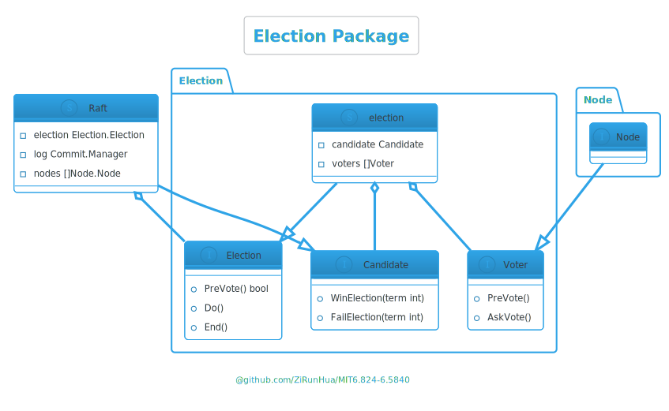

## lab3
### 需求
[Lab 3: Raft](http://nil.csail.mit.edu/6.5840/2024/labs/lab-raft.html)
### 系统设计
#### 模块划分
针对需求可以将实现分为三个主要模块 Election、Commit、Node，由三个模块共同组成 Raft：
<div style="text-align:center">
	<a href="../img/lab3/module.png">
	  
	</a>
</div>

- Election 负责选举。
- Commit 负责管理日志，他有两个子模块，Manage 负责管理日志，LogStore 负责日志的存储和读取。
- Node 负责和其他节点的通讯、保持 Leader 地位（发送心跳），以及存储节点的临时状态（不持久化），存储状态包括节点的同步进度，以及提交进度。

模块间的调用关系如下：
<div style="text-align:center">
  
</div>
Raft 在需要发起选举时，将新的选举号传递给 Election，Election 向 Node 发送预选举，预选举通过后向 Node 发送拉票请求，Election 选举结束后向 Raft 报告选举结果和 term，Raft 根据当前状态，来决定是否转变身份。

Raft 将接收的日志和快照交由 Commit 处理，Commit 将数据交由 LogStore 存储，并在处于 Leader 状态时启用 Manager，由 Manager 负责向 Follower 同步状态、维持 Follower 的同步进度，以及完成被大多数节点成功同步的日志的两阶段提交。

#### 锁顺序

为各个模块设置锁，从而减低锁的颗粒度，提高性能，同时为了避免死锁，对于 Election 和 Commit 向 Raft 的回调，需解除当前锁后回调、或在新的协程中发起回调，最后依照模块调用关系形成如下锁顺序：
<div style="text-align:center">
  
</div>

### Package 设计
#### UML
根据模块划分，将各模块设置为独立的包，由 Raft 进行统一管理，整体大致构成如下依赖关系：
<div style="text-align:center">
  
</div>
Raft 结构体在各包中承担不同角色，提供相应的接口方法。在 Election 包中充当 Candidate 提供选举完成后的回调，在 Commit 包中提供提交应用以及持久化的接口，在 Node 包中提供任期过期的回调，以及提供一些 RPC 调用和公共方法。

#### Election Package

##### UML

<div style="text-align:center">
  
</div>

- 在 `Election` 看来，整个 Raft 实例是一个 `Candidate`，负责竞选并处理选举结果。
- 集群中的每个 `Node` 被视为 `Voter`，负责参与预选和正式投票。
##### 成为Leader的条件
- 最后一条日志最新。
- 论文 `Figure 8` 中提到的 Leader 需要拥有所有已提交的日志条目。

##### 预选举
每次选举会 New 一个新的 Election，并在通过预选举后发起正式选举，测试中频繁让节点失联，所以引入预选举机制保证 Leader 免受重连节点的影响是非常有必要的，对于性能的提高很有帮助。
>预选举介绍
>
>在 Raft 算法中，Follower 节点如果在一定时间内未接收到 Leader 的心跳，会认为当前 Leader 已失效，并通过自增 term 发起选举。但如果该 Follower 因网络分区等原因无法与集群中的其他节点通信，其选举必然失败。此时，该 Follower 会不断重复这一过程，导致其 term 值持续增长。
>
>当分区的 Follower 重新与集群中的其他节点建立通信时，由于其 term 值比当前 Leader 和其他节点都大，根据 Raft 规则，Leader 会发现自身的 term 较小并转为 Follower 状态。然而，由于没有新的 Leader 产生，集群必须重新发起选举，才能恢复正常工作。 
>预选举通过在正式发起选举前，候选节点向集群中的其他节点发送预选投票请求，询问自己是否具备选举资格。如果大多数节点同意，其才会自增 term 并发起正式选举。这样可以有效避免脱离集群的节点因无意义的 term 增长而干扰集群的正常运行。
#### Commit Package
这是最重要的包，主要负责日志的管理，Node 在这里充当 Follower，提供了状态同步、应用同步和同步进度更新等接口。

##### UML
<div style="text-align:center">
  
</div>

##### 日志的提交应用
> “提交”或“提交应用”一般指的是，向实验测试提供的 `chan` 提交数据

为了顺利通过测试，了解测试是非常有必要的，提交应用的测试代码主要在 `/src/Raft/config.go` 下两个方法 `applier` 和 `checkLogs` ，它们的要求主要是：
- 按 `index` 顺序提交，不可以跳过某个 `index`。
- 每个节点提交 `index` 对应的内容必须相同，需要应对论文 `Figure 8` 描述的情况，实验中有针对该情况的两个测试 `TestFigure83C` 和 `TestFigure8Unreliable3C`。

完成以上要求需要使用两阶段提交：
<div style="text-align:center">
  
</div>

Leader 在接收日志后，向所有 Follower 同步该日志，当该日志被集群中大多数节点同步后，发起该进度的预提交，也就是向已同步 Follower 发送该日志的 index，Follower 接收到预提交 RPC 后，保存该进度，同时进行持久化，持久化完成后才可以应答该 RPC。

为了尽量缩短一条日志从同步到提交应用所花费的时间，Leader 最好在每次向某个 Follower 同步成功后，都检查一次是否有新的日志被集群中的大多数节点同步成功，但在实现上如果多个 Follower 同时同步成功，显然我们只需要检查一次就够了，所以你或需要一个[Throttler](https://github.com/ZiRunHua/MIT6.824-6.5840/src/util/chanUtil/throttle.go)。

**预提交**

预提交的目的是，将新的提交进度向，日志已同步到该进度的 Follower 同步，最终使得该进度在大多数节点上一致。
Leader 在检查到一条新的日志被大多数节点同步后，更新自己的提交进度并且持久化，同时向已同步该日志的 Follower 发起预提交，Follower 在接收到预提交后会更新提交进度并且持久化，因为是在同步成功后发起预提交，所以持久化的数据中包含了同步成功的日志，即需要被提交的日志条目，所以最终提交阶段不需要再次持久化。
如果 Leader 在预提交的过程中发生中断（Leader 变更、被 Kill 等）：
- 如果提交进度被大多数节点接收并持久化，那么预提交还是成功。
	那么该提交进度就是集群的最新提交进度不会丢失，选举机制保证新 Leader 拥有最新的提交进度的所有日志条目，如果新 Leader 提交进度并不是最新，但只要它拥有集群最新提交进度的日志（Leader 不会覆盖或删除自己的日志只会追加），那么在日志的同步过程中，还是会将集群的提交进度推进至一样的进度，因此也保证了，预提交成功后无论在进入确认提交之前，还是确认提交的过程中发生中断都是安全。
- 如果提交进度没被大多数节点接收并持久化。
	因此不能保证新的 Leader 拥有该提交进度的所有日志，可能选举出的 Leader ，不存在同步到该进度的所有日志，那么这部分日志的丢失是可以接受的，实验更加希望提交应用的日志必须是按顺序且一致的，否则会让基于该 Raft 的 kv 系统无法正常运行。

**最终提交**

预提交成功后，最终提交可以异步进行，只需要保证提交时按 index 顺序即可，实现上显然用一个协程读取 `chan` 再合适不过，值得注意的是最终提交阶段不需要进行持久化，所有需要持久化的数据都应该在预提交阶段完成持久化。

为了保证选举出的 Leader 拥有集群最新提交进度（被大多数节点同步的提交进度）的所有日志，我的做法是在请求投票时携带最新日志、最新提交进度以及未提交的所有日志。
节点在接收到来自其他节点的预选举或拉票请求时，判断日志是否通过的条件大致是：
- 对方日志更新同时提交进度更新，通过
- 对方日志更新，但提交进度是旧的，检查对方未提交日志中，在两个提交进度之间的日志是否一致，一致则通过。
> 我的做法存在一定优化空间，当一个节点在向其他节点发送拉票或预选举请求时，需要携带所有未提交的日志，数据可能过大，在一些测试中观察到 Candidate 选举时一个 RPC 发送上百条日志，而需要用到的只是两个提交进度之间的日志（可能只有几条），在 Candidate 提交进度较新时甚至用不到，可能的一种解决方案是：预选举或拉票请求仅发送最新日志和最新提交进度，当节点在接收到预选举或拉票请求时，发现提交进度是旧，则将提交进度间相差的日志返回给对方，由对方进行检查这部分日志是否一致，一致才可以认为是通过的，如此便减少了选举时使用的带宽，但是这带来了一个问题，投票的结果的决定权，由 Candidate 和 Follower 共同决定，这可能与直觉相悖。

##### 持久化
持久化话非常简单，只需要在 Lab3 的基础上，在合适的地方调用持久化方法即可。

> 掉过的一些坑：
> 
> 除了预提交需要堵塞等待持久化完成外，其他任何地方一样需要堵塞调用持久化，而不是异步调用，因为需要持久化完成后才可以返回成功，如果提前返回成功，节点被 crash 后会出现各种问题。针对持久化我也写了一个可以堵塞调用方的节流器[BlockingThrottler](https://github.com/ZiRunHua/MIT6.824-6.5840/src/util/chanUtil/throttle.go)。
>
>实验自带了 Gob 编码，Gob 非常重要的是它会包含数据原始类型信息，在序列化和反序列的过程中不丢失类型，序列化时会记录 `interface{}` 变量内部的类型信息，所以是用 json 这种不具备类型安全的序列化工具，进行持久化会导致不通过测试，这是我走过的坑。
>
> 我在一开始时没注意到实验给出了使用 gob 持久化的示例，我直接使用 json，实验的一些测试中使用 `rand.Int()` 作为需要同步的日志传入 Raft ，`rand.Int()` 可能会产生很大的 `int` 数，然而经过 json 序列化和反序列化后，数据类型很可能变为 `float` ，如果你没有在日志中打印变量类型（正常都不会），你会观察到集群已经达成一致状态了，但测试还是报告：`one(×) failed to reach agreement` ，因为实验中需要同步日志的数据类型都是 `interface{}` ，而 `interface{}` 变量间的比等首先检查的的类型信息。
##### LogStore

LogStore 没什么好说的主要就是维护数据的存储和查询，我使用了这样的数据结构：
```go
type logStore struct {  
    entries        []*LogEntry  
    entriesByIndex map[int]*LogEntry  
    snapshot       *Snapshot  
    length         int  
  
    logMu sync.RWMutex  
}
```
> 值得一提的是，在 Lab3 1000 次测试通过的情况下，我在 Lab4 的测试中发现了由 Lab3 部分导致的测试失败，所以或许需要 10000 次测试通过才证明 Raft 实现的稳定性。
> 
> 具体失败原因是：LogStore 中没有考虑一些边界情况，导致在一些特殊情况下 LogStore 中获取同步数据的方法返回中缺少了快照，导致同步数据后，Follower 缺失了快照数据，但这个并没有导致 Lab3 1000次测试中出现失败。
#### Node Package
Node 包主要负责向节点发起 RPC 以及保存节点的临时状态，作为 Leader 时启动心跳定时器，也充当 Leader 与向其他节点发起 RPC 的中间件。
##### UML

<div style="text-align:center">
  
</div>

在 lab3C 中除了引入实验提到的回退算法的优化外，还引入了一次同步多条日志的优化，在我没有引入这个优化之前我无法通过 `TestFigure8Unreliable3C` 测试。

`TestFigure8Unreliable3C` 测试会向 Leader 传入 1000 条日志，在这个过程中不停得概率性（每次向 Leader 传入一条日志后有 50% 的概率）发生 Leader 失联，并且 RPC 调用有三分之二的概率发生长等待，等待时间在 
200ms~2200ms（实验中的代码是`200 + rand.Intn(1+rand.Intn(2000))`），1000 条传入完成之后，最后恢复所有节点的通讯，传入一条日志并要求集群在 10 秒内达到一致状态，可以看出这个测试延长了一条日志同步所耗费的时间，Leader 的不停失联导致无法工作，在最后一条日志传入后，Leader 需要 10 秒内完成的同步的日志可能会有几百条，我能想到的做法就是引入一次同步多条日志的优化。

> 比较惭愧的是，我需要将一次同步的最大数量设置为 200 条，才能比较稳定地完成 1000 次测试通过。或许我应该考虑其他优化方法，而不是去修改这个魔法值。

lab3D 中提到需要实现 `InstallSnapshot` RPC，但我认为将 `AppendEntries` 和 `InstallSnapshot` 合并为 `SyncState` 更合适，这样可以简化逻辑，同时也减少从 lab3C 到 lab3D 需要修改的代码。

Node 包也充当发起 RPC 的中间件，这个中间件会做两件事：
- 进行 term 检查，发现 Leader 的任期过期，直接向 Raft 发起回调。
- 忽略一些非必要的 RPC ，同时向调用方返回发送成功的假象。
显然在 io 密集型系统中，减少不必要的 io 操作至关重要，因为它对性能的提升有显著影响，在 node 包中过滤不必要的 RPC 在实现上更加容易。
>在没有忽略一些不必要的 RPC 前无法通过 `TestCount3B`。

我会在以下几种情况下不发起 RPC 返回虚假成功：
- 短时间内向 Follower 发送过消息时，忽略心跳。
- 向 Follower 发送的过时（相较于目前的新提交进度）的”预提交” RPC 和“确认提交” RPC 不发起，直接返回成功。

>我曾经将所有‘确认提交’的 RPC 延后处理，不再立即发起，而是等到下次心跳或日志同步时一起携带”确认提交“信息。虽然减少了 io 次数，但导致完成所有测试的时间从 5m30s 来到了 8m+（实验要求为 6m）。显然，虽然减少了 io 次数，但延长了完成日志同步到提交应用的时间。可以看出，缩短日志同步到提交的时间，对性能的影响很大。

