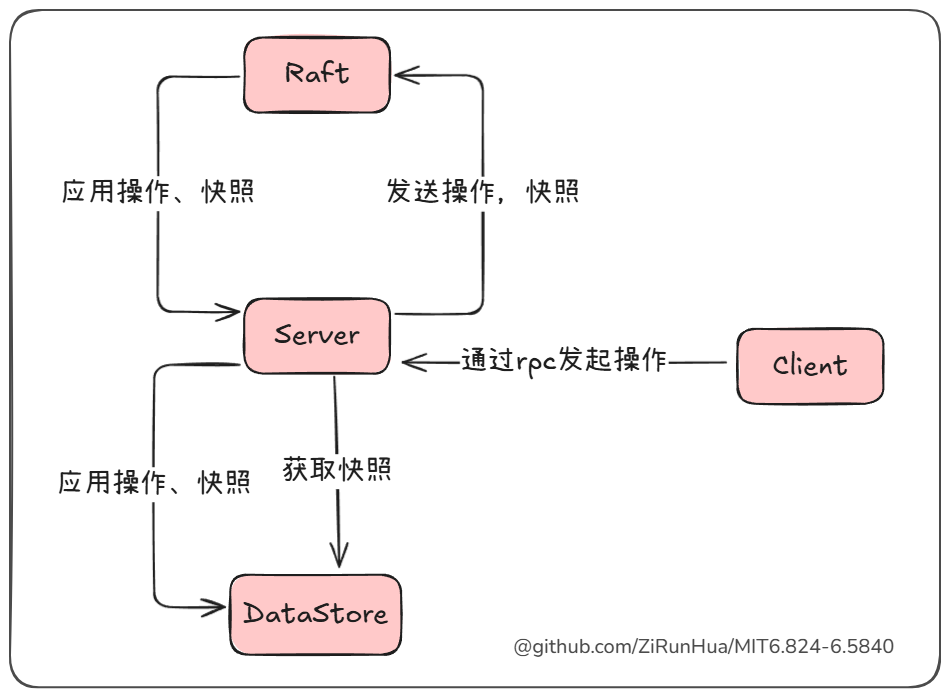
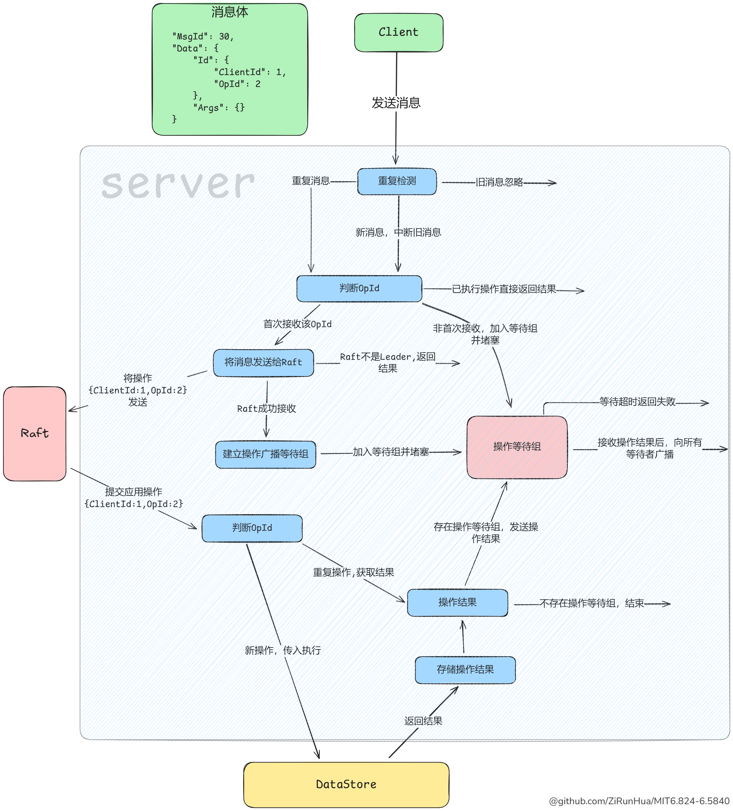

# lab4
## 需求
- 实现一个 key/value 存储服务，有多个 Raft 进行复制。
- Get/Put/Append 方法的调用是线性化的，同时保证多个 Raft 上的执行顺序相同，与 lab2 不同 Put/Append 不需要返回值。
- 需要处理通过 RPC 调用 raft.Start() 后，Leader 失去领导权的情况，对于出现分区的情况，可以无限等待直到分区结束。
- 需要实现消息的重复检测。
## 通关标准

- 400秒的实际运行时间和600秒的CPU时间（来自lab4的最后一个`Hint`），以及TestSnapshotSize测试小于20秒。

在此之前有必要读下助教的文章
https://thesquareplanet.com/blog/students-guide-to-raft/#applying-client-operations

## RPC调用优化
在开始实验前有必要优化下实验RPC，下面以lab2为例
实验中的RPC实验方式如下：
```go
args, reply := GetArgs{Key: "test"}, GetReply{} 
ok := e.Call("ShardKV.Get", &args, &reply)
```
这个调用方式有以下几个缺点：
- 方法名使用字符串：手写字符串容易拼写错误。
- 类型安全性不足：args 和 reply 需要手动声明，并通过指针传递，并且是interface{}类型,容易出错。
当然也可以对每个RPC方法进行封装来避免这些问题，例如：
```go
func Get(e *labrpc.ClientEnd, args GetArgs) (ok bool, reply GetReply) {  
    ok = e.Call("ShardKV.Get", &args, &reply)  
    return  
}
```
但如果每声明一个RPC都要写一个封装方法，我认为太过麻烦了，我不想把时间花在这上面，假设现在是一个庞大的系统，有非常的多的RPC，那我肯定会非常不喜欢这个工作。
**优化思路**
我们希望让 RPC 调用更像普通方法调用，同时提升类型安全性和可读性。使用泛型刚好就能解决

一个RPC方法由三部分组成，方法名（一个字符串）、传入参数和返回参数构成，所以可以定义为如下类型：
```go
type Method[args any, reply any] string
```
然后定义它的调用方法：
```go
func (rm Method[Args, Reply]) Call(e *labrpc.ClientEnd, args Args) (bool, Reply) {
	var reply Reply
	return e.Call(string(rm), &args, &reply), reply
}
```
之后就可以这样声明和调用：
```go
const Get Method[GetArgs,GetReply] = "KVServer.Get"

ok, reply := Get.Call(ck.server, GetArgs{Key: "test"})
```
可以再call方法中塞入更多逻辑，最后你的lab2的client部分将变得非常简洁，我想没有人会不喜欢这么简洁的代码：
```go
type (  
    Method[args any, reply any] string  
)  
  
const (  
    RpcGet    Method[GetArgs, GetReply]             = "KVServer.Get"  
    RpcPut    Method[PutAppendArgs, PutAppendReply] = "KVServer.Put"  
    RpcAppend Method[PutAppendArgs, PutAppendReply] = "KVServer.Append"  
)  
  
func (rm Method[Args, Reply]) Call(e *labrpc.ClientEnd, args Args) (reply Reply) {  
    for !e.Call(string(rm), &args, &reply) {  
    }  
    return  
}  
  
func (ck *Clerk) Get(key string) string {  
    return RpcGet.Call(ck.server, GetArgs{Key: key, ClientId: ck.id, MsgId: nrand()}).Value  
}  
  
func (ck *Clerk) Put(key string, value string) {  
    RpcPut.Call(ck.server, PutAppendArgs{Key: key, Value: value, ClientId: ck.id, MsgId: nrand()})  
}  
  
func (ck *Clerk) Append(key string, value string) string {  
    return RpcAppend.Call(ck.server, PutAppendArgs{Key: key, Value: value, ClientId: ck.id, MsgId: nrand()}).Value  
}
```
在 lab4 中，我同样进行了如上优化，并将该部分代码连同 Client 模块和 Server 模块作为独立的包，供 lab4 和 lab5 使用，这减少了大量重复逻辑，可以更专注于实验核心内容。

## 系统设计
### 模块


#### Client
- 通过 RPC 调用发起操作和维持自身状态
- 由Clerk发起具体操作，每个Clerk有一个唯一的clientID，同时Clerk需要维持MsgID和OpID自增，对于一个操作用clientID以及client自身的OpID来标识唯一，即：
```go
	Id struct {  
	   ClientId, OpId int64  
	}
	// Data 操作数据  
	Data[T any] struct {  
	   Id     // Id 操作唯一标识  
	   Args T // Args 操作参数  
	}
```
#### Server
- 充当中间层，处理来自 Client 的请求，通过 RPC 接收操作。
- 与 Raft 模块交互，将应用操作和快照转发至 Raft 模块。
- 将Raft中获得一致性的操作（即Raft提交应用的操作），交由DataStore执行，并将结果返回给正在等待的client。
- 在适当时发起快照，从DataStore获取快照并转发至Raft，以及将Raft获得一致性的快照交由DataStore用于数据加载。
#### DataStore
- 负责持久化存储数据和快照。
- 提供数据操作的接口，用于 Server 执行操作。
- 提供快照的获取和加载的接口，供Server使用
### RPC包
RPC包中包含了rpc方法、Client模块、Server模块，以及operation和err等结构体，整体结构如下：
```
|   rpc.go
|
+---operation
|       operation.go
|
+---rpcClient
|       client.go
|       server.go
|
+---rpcErr
|       error.go
|
\---rpcServer
        client.go
        opWaiter.go
        server.go
```
#### rpc.go
rpc文件主要由两部分组成，对外接口：
```go
type (  
    Clerk interface {  
       NewOperationId() operation.Id  
       GetLeader() rpcClient.Server  
       GetServers() []rpcClient.Server  
       UpdateLeader(leaderIndex int)  
    }  
  
    Server[T operation.Value] interface {  
       WaitCommand(msgId int64, op operation.Provider) (T, rpcErr.Err)  
       Kill()  
    }  
  
    DataStore[T operation.Value] interface {  
       Operation(provider operation.Provider) T  
       GetSnapshot() interface{}  
       LoadFormSnapshot(interface{})  
       DebugLog(name string, msg string, details ...interface{})  
    }  
)
```
rpc封装：
```go
type (  
    Method[args any, reply any] string  
    CommonArgs[T any]           struct {  
       MsgId int64  
       operation.Data[T]  
    }  
    CommonReply[T any] struct {  
       Err  rpcErr.Err  
       Data T  
    }  
)  
  
func (rm Method[Args, Reply]) Init() {
    labgob.Register(&operation.Data[Args]{})  
    labgob.Register(&CommonArgs[Args]{})  
    labgob.Register(&operation.Data[Reply]{})  
    labgob.Register(&CommonReply[Reply]{})  
}  
  
func (rm Method[Args, Reply]) Call(ck Clerk, opArgs Args) Reply {  
	// todo
}
```
对RPC包后的方法声明将会很干净：
```go
const (  
    RpcPut    rpc.Method[PutArgs, struct{}]    = "KVServer.Put"  
    RpcAppend rpc.Method[AppendArgs, struct{}] = "KVServer.Append"  
    RpcGet    rpc.Method[GetArgs, GetReply]    = "KVServer.Get"  
)
```
#### operation
operation中主要定义了操作相关的结构体：
```go
package operation
type (
	Id struct {
		ClientId, OpId int64
	}
	// Data 操作数据
	Data[T any] struct {
		Id     // Id 操作唯一标识
		Args T // Args 操作参数
	}
	Provider interface {
		GetId() Id
	}
	Result[T Value] struct {
		Id    int64
		Err   rpcErr.Err
		Value T
	}
	// 操作的返回值类型 例如lab4的string或lab5 shardctrler的Config
	Value any
)

func (d *Data[T]) GetId() Id {
	return d.Id
}
```
操作使用clientID以及client自身的OpID来标识唯一
结合rpc.go文件中的`CommonArgs`结构体，可以看出一个消息组成有：
```json
{  
    "MsgId": 30,  
    "Data": {
        "Id": {  
            "ClientId": 1,  
            "OpId": 2  
        },  
        "Args": {}  
    }  
}
```
MsgId和OpId上由client维持自增的，MsgId与ClientId组合用来重复检测，ClientId与OpId组合作为操作的唯一标识，重复检测后MsgId就没用了，最后传给Raft的是Data。
#### rpcClient-Client模块
rpc调用的发起方，承担的作用非常简单，发起调用、更新leader、维持操作ID和MsgID自增
```go
Clerk interface {  
    NewOperationId() operation.Id  
    GetLeader() Server  
    GetServers() []Server  
    UpdateLeader(leaderIndex int)
}
```
> 后面提到的 Client 都代指 Clerk，可以理解为 Client 就是 Clerk 这个接口
#### rpcServer-Server模块
rpc调用的接收方，主要的职责是维护一个操作的声明周期，从接收客户端操作消息开始，到操作被最终应用，最后向客户端返回结果。
> 之前提到client会维持MsgId和OpId自增，没有使用随机数是为了让server可以判断出哪些是旧消息，以及在debug时可以清楚的看到操作的顺序
>我的客户端设计是，在rpc调用没有返回ok时会继续使用相同的MsgId发起重试。

##### 操作的生命周期


>实验声明了kv系统的操作是线性化的，也就说一个 Client 只有在执行完成一个操作后才会发起下一个，这简化的很多逻辑，这也让我们的 Client 针对某一 Server 的操作是线性化，即一个消息在发送到 Server 并得到答复后，才会发送下一个消息，但这并不代表一个 Server 只为一个 Client 提供服务，一个 Server 还是会同时为多个 Client 提供，我的设计中每个 Client 在 Server 中看来是分隔独立的，在 Server 中每个 Client 会有自己的操作等待组、存储操作结果的Map、lastMsgId等等，我希望在 Client 被 Kill 时向 Server 发送一个销毁的 RPC 来清空 Server 中的数据，同时 Server 在一段时间内没收到来自 Client 消息时，将该 Client 加入黑名单，并清空数据，但实验并没有对这块进行要求，所以我并没有实现 Server 缓存数据的清洁。
  因为操作的线性化，并且在我们的设计中 Server 会为每个 Client 设置一个操作等待组，所以某个 Client 的操作等待组只需要等待一个操作，我们不需要设计一个可以同时等待多个操作完成的操作等待组

实验模拟了各种网络环境，针对客户端发来的消息会有以下三种情况：
- MsgId 是旧的，显然是网络延迟导致，因为操作的线性化所以可以直接忽略。
- MsgId 相同，可能是 Server 实际接收并答复，但网络导致 Server 的答复丢失，导致 Client 的 RPC 失败，这种情况 Client 需要不停重试，除此之外还有很多情况导致 MsgId 相同，针对相同的MsgId Server无法确定哪个是 Client 正在等待答复的，所以都需要当作正常的消息去处理。
- MsgId 是新的，针对这种情况有两种不同的处理：
	- MsgId 是新的，但 OpId 是旧的，如果 OpId 被处理过，显然直接返回之前存储的结果，如果 OpId 没被处理过，这可能是 Client 正在寻找可以执行操作的 Leader ，无论哪种情况，都应该加入操作等待组。
	- MsgId 和 OpId 都是新的，因为操作的线性化，Client 只有在一个操作完成后才发起新的操作，如果操作等待组中还有正在等待答复的RPC，就是广播后关闭等待组，然后使用新的等待组。
	
##### 操作的重复执行
在 Raft 提交应用后判断 OpId 是否重复就可以保证操作不被重复执行，在此基础上，在操作传入 Raft 前进行一次重复检测，来以免重复的操作增加 Raft 的同步压力

其实一张图胜千言，操作等待组的实现使用通道就能完成，如果你完成了lab4A，那lab4B的快照对你来说就非常容易了
### DataStorre模块
```go
DataStore[T operation.Value] interface {  
    Operation(provider operation.Provider) T  
    GetSnapshot() interface{}  
    LoadFormSnapshot(interface{})  
    DebugLog(name string, msg string, details ...interface{})  
}
```
完成了正确的RPC包后，lab4和lab5A只需要实现DataStore接口便完成了实验。