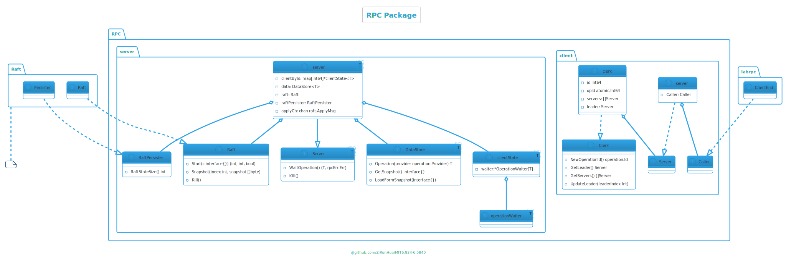
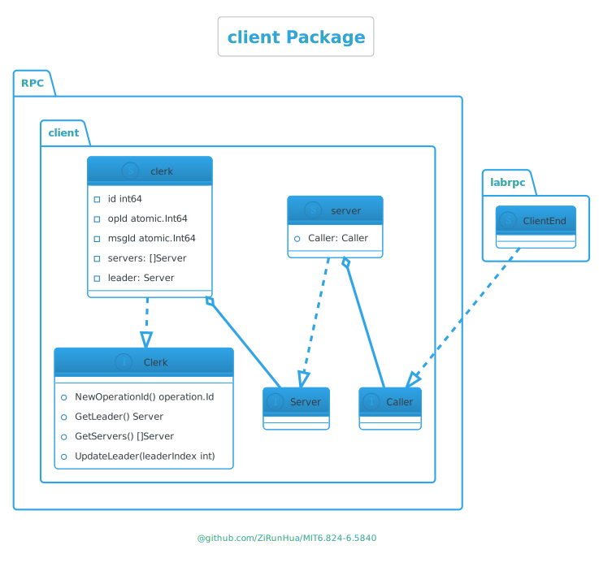
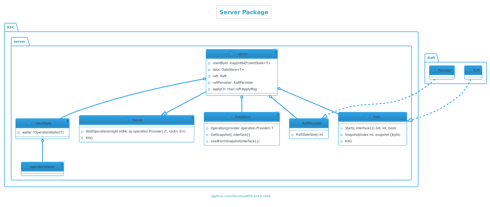
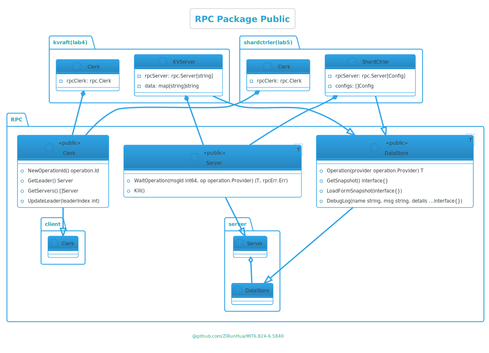

# lab4
## <a name=''></a>目录
<!-- vscode-markdown-toc -->
- [lab4](#lab4)
  - [目录](#目录)
  - [需求](#需求)
  - [RPC调用优化](#rpc调用优化)
    - [优化思路](#优化思路)
  - [模块划分](#模块划分)
    - [Client](#client)
    - [Server](#server)
    - [DataStore](#datastore)
  - [RPC Package](#rpc-package)
    - [operation](#operation)
    - [Client Package](#client-package)
      - [UML](#uml)
    - [Server Package](#server-package)
      - [操作的生命周期](#操作的生命周期)
      - [操作的重复执行](#操作的重复执行)
      - [UML](#uml-1)
    - [rpc.go](#rpcgo)
      - [对外接口](#对外接口)
      - [ RPC 封装](#-rpc-封装)

<!-- vscode-markdown-toc-config
	numbering=false
	autoSave=false
	/vscode-markdown-toc-config -->
<!-- /vscode-markdown-toc -->
## <a name='-1'></a>需求
[Lab 3: KvRaft](http://nil.csail.mit.edu/6.5840/2024/labs/lab-kvraft.html)
- 实现一个 key/value 存储服务，有多个 Raft 进行复制。
- Get/Put/Append 方法的调用是线性化的，同时保证多个 Raft 上的执行顺序相同，与 lab2 不同 Put/Append 不需要返回值。
- 需要处理通过 RPC 调用 raft.Start() 后，Leader 失去领导权的情况，对于出现分区的情况，可以无限等待直到分区结束。
- 需要实现消息的重复检测。

在此之前有必要读下助教的文章
https://thesquareplanet.com/blog/students-guide-to-raft/#applying-client-operations

## <a name='RPC'></a>RPC调用优化
在开始实验前有必要优化下实验 RPC，下面以 lab2 为例
实验中的 RPC 调用方式如下：
```go
args, reply := GetArgs{Key: "test"}, GetReply{} 
ok := e.Call("ShardKV.Get", &args, &reply)
```
这个调用方式有以下几个缺点：
- 方法名使用字符串：手写字符串容易拼写错误。
- 类型安全性不足：`args` 和 `reply` 是 `interface{}` 类型，并且需要传入指针，使用时没有类型提示容易出错。

当然也可以对每个 RPC 都进行封装方法来避免这些问题，例如：
```go
func Get(e *labrpc.ClientEnd, args GetArgs) (ok bool, reply GetReply) {  
    ok = e.Call("ShardKV.Get", &args, &reply)  
    return  
}
```
但如果每声明一个 RPC 都要写一个封装方法，太过麻烦了，假设现在是一个庞大的系统，有非常的多的 RPC，如果每个 RPC 都要写一个封装方法那太影响开发效率了

### <a name='-1'></a>优化思路

**我希望让 RPC 调用更像普通方法调用（这才更像 RPC），同时提升类型安全性和可读性**。使用泛型刚好能够解决

一个 RPC 方法由三部分组成，调用对象（一个字符串）、传入参数和返回参数构成，定义为如下结构：
```go
type Method[args any, reply any] string
```
定义调用方法：
```go
func (m Method[Args, Reply]) Call(e *labrpc.ClientEnd, args Args) (bool, Reply) {
	var reply Reply
	return e.Call(string(m), &args, &reply), reply
}
```
之后就可以这样声明和调用：
```go
const Get Method[GetArgs,GetReply] = "KVServer.Get"

ok, reply := Get.Call(ck.server, GetArgs{Key: "test"})
```
可以在 Call 方法中塞入更多逻辑，最后 lab2 的 client.go 部分将变得非常简洁，我想没有人会不喜欢这么简洁的代码：
```go
type (  
    Method[args any, reply any] string  
)  
  
const (  
    RpcGet    Method[GetArgs, GetReply]             = "KVServer.Get"  
    RpcPut    Method[PutAppendArgs, PutAppendReply] = "KVServer.Put"  
    RpcAppend Method[PutAppendArgs, PutAppendReply] = "KVServer.Append"  
)  
  
func (m Method[Args, Reply]) Call(e *labrpc.ClientEnd, args Args) (reply Reply) {  
    for !e.Call(string(m), &args, &reply) {  
    }  
    return  
}  
  
func (ck *Clerk) Get(key string) string {  
    return RpcGet.Call(ck.server, GetArgs{Key: key, ClientId: ck.id, MsgId: nrand()}).Value  
}  
  
func (ck *Clerk) Put(key string, value string) {  
    RpcPut.Call(ck.server, PutAppendArgs{Key: key, Value: value, ClientId: ck.id, MsgId: nrand()})  
}  
  
func (ck *Clerk) Append(key string, value string) string {  
    return RpcAppend.Call(ck.server, PutAppendArgs{Key: key, Value: value, ClientId: ck.id, MsgId: nrand()}).Value  
}
```
## <a name='-1'></a>模块划分

<div style="text-align:center">
  
</div>

### <a name='Client'></a>Client
- 通过 RPC 调用发起操作和维持自身状态

### <a name='Server'></a>Server
- 充当中间层，处理来自 Client 的请求，通过 RPC 接收操作。
- 与 Raft 模块交互，将应用操作和快照转发至 Raft 模块。
- 将 Raft 中获得一致性的操作（即Raft提交应用的操作），交由 DataStore 执行，并将结果返回给正在等待的 Client。
- 在适当时发起快照，从 DataStore 获取快照并转至 Raft，以及将 Raft 获得一致性的快照交由 DataStore 用于数据加载。
### <a name='DataStore'></a>DataStore
- 负责持久化存储数据和快照。
- 提供数据操作的接口，用于 Server 执行操作。
- 提供快照的获取和加载的接口，供 Server 管理快照。

## <a name='RPCPackage'></a>RPC Package
在完成 Lab3 的 Raft 后，后续 Lab4 和 Lab5 实验都是基于 Raft 去构建系统，
所以有必要设计一个包去封装客户端与集群的交互，以及服务端对 Raft 的管理，而我们只需要在应用层处理一致性提交后的数据存储。

**实现目标：让 RPC 调用不再针对某个服务端发起，而是针对整个集群，集群中的某一基于 Raft 的服务端，不需要关心 Raft 的具体细节，只需关心 Raft 集群中达成一致的数据。** 


> 我相信实现这样一个包，会节省你很多时间，如此便可把更多精力放在后续实验的核心内容上
> 
> 通过 Lab4 验证你的 RPC 包，以便在之后的实验中畅通无阻的使用

下面将逐步描述如何实现这一目标，我将 RPC 包的职责主要定义为：
- 封装客户端交互：客户端只需通过 RPC 远程调用集群，无需关心 Leader 的变更，以及消息的重试。
- 抽象数据存储接口：提供 DataStore 接口，使用者只需实现该接口，即可在 Raft 达成一致后处理提交的数据，无需手动管理 Raft 交互。
- 管理操作的整个生命周期：接收来自客户端的 RPC 操作，完成去重后传入 Raft，在集群达成一致后，将操作提交应用层，最后将操作结果返回客户端。
- 管理服务端和 Raft 的交互：除了将来自客户端的操作传入 Raft 外，还负责处理 Raft 提交的数据，以及快照管理。

依照职责将 RPC 包划分为两部分，Client 与 Server，构成如下 UML：

<div style="text-align:center">
  
</div>


整体实现目录结构如下：
```bash
|   rpc.go
|
+---client
|       client.go
|       server.go
|
+---operation
|       operation.go
|
+---rpcErr
|       error.go
|
\---server
        client.go
        opWaiter.go
        server.go
```

### <a name='operation'></a>operation
对于 RPC 包的实现，首先要了解操作和消息的定义，operation中主要定义了操作相关的结构体：

```go
package operation
type (
	// Id 每个 Client 会维持自身的 OpId 自增，一个操作使用 ClientId 和 OpId 来标识唯一
	Id struct {
		ClientId, OpId int64
	}
	// Data 操作数据
	Data[T any] struct {
		Id     // Id 操作唯一标识
		Args T // Args 操作参数
	}
	Provider interface {
		GetId() Id
	}
	Result[T Value] struct {
		Id    int64
		Err   rpcErr.Err
		Value T
	}
	// Value 操作的返回值类型 也是`RPC`包中的泛型的类型 例如lab4的string、lab5中shardctrler的Config
	Value any
)

func (d *Data[T]) GetId() Id {
	return d.Id
}
```
由此可见，我们可以这样定义一个消息
```go
type CommonArgs[T any] struct {  
    MsgId int64  
    operation.Data[T]  
}  
```
可以看出一个消息组成为：
```json
{  
    "MsgId": 30,
    "Data": {
        "Id": {
            "ClientId": 1,
            "OpId": 2 
        },
        "Args": {}
    }
}
```
MsgId 和 OpId 由 client 维持自增的，MsgId 与 ClientId 组合用来重复检测，ClientId 与 OpId 组合作为操作的唯一标识，重复检测后 MsgId 就没用了，最后传给 Raft 的是 Data 部分。

### <a name='ClientPackage'></a>Client Package
RPC 调用的发起方，承担的作用非常简单，主要提供获取集群服务、更新 Leader 等接口方法，并负责维护操作 ID 和 MsgID 的自增。

#### <a name='UML'></a>UML

<div style="text-align:center">
  
</div>

> 后面提到的 Client 都代指 Clerk 这个接口

### <a name='ServerPackage'></a>Server Package
RPC 调用的接收方，主要的职责是维护一个操作的生命周期，从接收客户端操作消息开始，将操作传入 Raft，到操作被 Raft 提交，将操作通过 DataStore 接口应用，最后向等待的客户端返回操作结果。

#### <a name='-1'></a>操作的生命周期

<div style="text-align:center">
  
</div>

实验说明了 kv 系统的操作是线性化的，也就说一个 Client 只有在执行完成一个操作后才会发起下一个，这简化的很多逻辑，这也让 Client 针对某一 Server 的操作是线性化，即一个操作在发送到 Server 并得到答复后，才会发起下一个操作，但这并不代表一个 Server 只为一个 Client 提供服务，一个 Server 还是会同时为多个 Client 提供。

我的设计中每个 Client 在 Server 中看来是分隔独立的，每个 Client 在 Server 中会有自己独立的操作等待组、存储操作结果的Map、lastMsgId等等，我希望在 Client 被 Kill 时，向 Server 发送一个销毁的 RPC 来清空 Server 中的数据，同时 Server 在一段时间内没收到来自 Client 消息时，将该 Client 加入黑名单，并清空数据，但实验并没有对这块进行要求，所以我并没有实现 Server 对 Client 缓存数据的清理。

因为操作的线性化，并且在我的设计中 Server 会为每个 Client 设置一个操作等待组，所以某个 Client 的操作等待组只需要等待一个操作，不需要设计一个可以同时等待多个操作完成的操作等待组。

实验模拟了各种网络环境，针对客户端发来的消息会有以下三种情况：
- MsgId 是旧的，显然是网络延迟导致，因为操作的线性化所以可以直接忽略。
- MsgId 相同，可能是 Server 实际接收并答复，但网络导致 Server 的答复丢失，导致 Client 的 RPC 失败，这种情况 Client 需要不停重试，除此之外还有很多情况导致 MsgId 相同，针对相同的MsgId Server无法确定哪个是 Client 正在等待答复的，所以都需要当作正常的消息去处理。
- MsgId 是新的，针对这种情况有两种不同的处理：
	- MsgId 是新的，但 OpId 是旧的，如果 OpId 被处理过，显然直接返回之前存储的结果，如果 OpId 没被处理过，这可能是 Client 正在寻找可以执行操作的 Leader ，无论哪种情况，都应该加入操作等待组。
	- MsgId 和 OpId 都是新的，因为操作的线性化，Client 只有在一个操作完成后才发起新的操作，如果操作等待组中还有正在等待答复的RPC，直接广播后关闭等待组，然后使用新的等待组。
	
#### <a name='-1'></a>操作的重复执行
在 Raft 提交应用后判断 OpId 是否重复就可以保证操作不被重复执行，在此基础上，在操作传入 Raft 前进行一次重复检测，来以免重复的日志增加 Raft 的同步压力。

其实一张图胜千言，操作等待组的实现使用通道就能完成，如果你完成了lab4A，那lab4B的快照对你来说就非常容易了
#### <a name='UML-1'></a>UML

<div style="text-align:center">
  
</div>

### <a name='rpc.go'></a>rpc.go

rpc.go 主要由对外接口和 RPC 封装两部分构成。

#### <a name='-1'></a>对外接口

rpc.go 通过 `DataStore<T>`、`Server<T>` 和 `Clerk` 三个接口为外部提供依赖，使用 RPC 包需要实现 `DataStore` 接口，然后使用 `DataStore` 来生成 `Server`。

<div style="text-align:center">
  
</div>

#### <a name='RPC-1'></a> RPC 封装
开头提到的关于 RPC 的优化，现在更上一层，加入了 `CommonArgs` 和 `CommonReply` ，它们在 Call 方法中被使用， Call 方法的返回是一个操作完成后的结果，是的，Call 方法不会返回失败，Call 方法中利用 Clerk 接口，完成客户端与集群的全部交互，包括寻找 Leader ，消息重试，直到操作被服务器应答成功，然后 Call 方法返回操作结果，如此将 RPC 不再是针对某个 Raft 或 Server 发起，而是针对整个集群发起。
> 别忘了调用 `labgob.Register` 注册结构体

```go
type (  
    Method[args any, reply any] string  
    CommonArgs[T any]           struct {  
       MsgId int64  
       operation.Data[T]  
    }  
    CommonReply[T any] struct {  
       Err  rpcErr.Err  
       Data T  
    }  
)  
  
func (rm Method[Args, Reply]) Init() {
    labgob.Register(&operation.Data[Args]{})  
    labgob.Register(&CommonArgs[Args]{})  
    labgob.Register(&operation.Data[Reply]{})  
    labgob.Register(&CommonReply[Reply]{})  
}  
  
func (rm Method[Args, Reply]) Call(ck Clerk, opArgs Args) Reply {  
	cArgs := CommonArgs[Args]{  
	    Data: operation.Data[Args]{  
	       Id:   ck.NewOperationId(),  
	       Args: opArgs,  
	    },  
	}  
	cReply := new(CommonReply[Reply])
	// todo
}
```
一样是非常干净的声明：
```go
const (  
    RpcPut    rpc.Method[PutArgs, struct{}]    = "KVServer.Put"  
    RpcAppend rpc.Method[AppendArgs, struct{}] = "KVServer.Append"  
    RpcGet    rpc.Method[GetArgs, GetReply]    = "KVServer.Get"  
)
```

完成了正确的RPC包后，lab4 和 lab5A 只需要实现 DataStore 接口便完成了这部分实验，当然，lab5A 的分片可能要多花点时间。